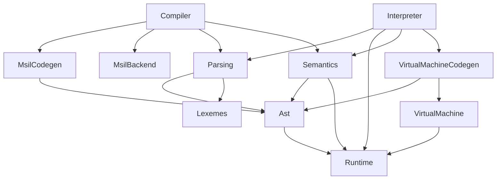

# Интерпретатор языка Tiger

Tiger — это учебный язык программирования, разработанный Andrew Appel для книг и курсов в Princeton University примерно в 2004 году.

Цель этого проекта — написать компилятор и интерпретатор Tiger на C# для использования студентами [ПГТУ](https://www.volgatech.net) в качестве примера.

Особенности:

* Проект написан на C# 14 и .NET 10
* Общий фронтенд языка Tiger используется как компилятором, так и интерпретатором
* Интерпретатор работает поверх собственной виртуальной машины ‒ TigerVM
* Компилятор генерирует код на MSIL и исполняемый файл для среды выполнения .NET 10+

## Статус

Статус поддержки возможностей языка:

1. [x] Валидация программы на соответствие грамматике на ANTLR4
2. [x] Лексический анализ
3. [x] Разбор и вычисление выражений
4. [x] Переменные, let...int... и присваивания
5. [x] Ветвления
6. [x] Пользовательские функции и процедуры
7. [x] Циклы while и for
8. [x] Массивы и объявления типов
9. [x] Структуры и nil

Статус поддержи фаз компиляции в интерпретаторе:

1. [x] Лексический анализ
2. [x] Синтаксический анализ
3. [x] Семантический анализ
4. [x] Генерация кода для виртуальной машины TigerVM
5. [x] Выполнение программы

Статус поддержи фаз компиляции в компиляторе:

1. [x] Лексический анализ
2. [x] Синтаксический анализ
3. [x] Семантический анализ
4. [ ] Генерация MSIL для среды выполнения .NET 10+ (_в процессе, см. ниже_)
5. [x] Генерация исполняемого файла для .NET 10+

## Ветки

Проект разделён на три фазы.

### Первая фаза: интерпретатор + AST

На этой фазе последовательно разрабатывается фронтенд языка. Вместо бэкенда — интерпретация AST.

| Ветка               | Что добавляет                        |
|---------------------|--------------------------------------|
| 01_grammar_checker  | Валидатор синтаксиса на ANTLR4       |
| 02_lexical_analysis | Лексический анализ Tiger             |
| 03_expressions      | Разбор выражений                     |
| 04_variables        | Переменные и присваивания            |
| 05_if_else          | Ветвления                            |
| 06_functions        | Пользовательские функции и процедуры |
| 07_loops            | Циклы for и while, выражение break   |
| 08_arrays           | Массивы и объявления типов           |
| 09_records          | Структуры и nil                      |

### Вторая фаза: виртуальная машина для интерпретатора

На этой фазе появляется первый бэкенд — виртуальная машина TigerVM.

| Ветка               | Что добавляет                       |
|---------------------|-------------------------------------|
| 10_benchmarks       | Бенчмарк программ на Tiger          |
| 11_virtual_machine  | Виртуальная машина для языка Tiger  |
| 12_code_coverage    | Сбор отчёта о покрытии кода тестами |
| 13_acceptance_tests | Дополнительные приёмочные тесты     |

### Третья фаза: компиляция для MSIL

На этой фазе кроме интерпретатора появляется компилятор, который генерирует MSIL для выполнения в среде .NET.

| Ветка                       | Что добавляет                                   |
|-----------------------------|-------------------------------------------------|
| 14_msil_backend             | Компиляция для .NET и функции ввода-вывода      |
| 15_msil_ilverify            | Запуск ILVerify для проверки MSIL в тестах      |
| 16_msil_expressions         | Вычисление выражений для типов int и string     |
| 17_msil_logical_expressions | Вычисление логических "и", "или", "не"          |
| 18_msil_variables           | Переменные, присваивания, области видимости     |
| 19_msil_branching           | Ветвления if-else                               |
| 20_msil_loops               | Циклы while и for, выражение break              |
| 21_user_functions           | Пользовательские функции                        |
| 22_type_aliases             | Поддержка объявлений синонимов типов            |
| 23_scope_bugfix             | Исправление бага в обработке областей видимости |
| 24_arrays                   | Массивы, одномерные и многомерные               |
| 25_records                  | Структуры и nil, компиляция Решета Эратосфена   |

Пока ещё не реализованы:

* Взаимная рекурсия функций
* Захват функцией переменных окружающей области видимости

## Клонирование проекта

Клонирование без авторизации в SourceCraft:

```bash
# Клонируем репозиторий в каталог pstiger/
git clone https://git@git.sourcecraft.dev/sshambir-public/pstiger.git
```

Если у вас есть аккаунт SourceCraft и вы настроили SSH-ключи, то можно клонировать по SSH:

```bash
# Клонируем репозиторий в каталог pstiger/
git clone ssh://ssh.sourcecraft.dev/sshambir-public/pstiger.git
```

## Установка утилит

Для проверки сгенерированного MSIL в тестах вызывается утилита ILVerify.

```bash
dotnet tool install --global dotnet-ilverify --version 10.0.3
```

Для отладки в случае проблем кодогенерации пригодится утилита ILDasm:

```js
dotnet
tool
install--
global
dotnet - ildasm--
version
0.12
.2
```

## Сборка

Для сборки нужен .NET 10 SDK.

Сборка консольной утилитой dotnet из .NET SDK:

```bash
# Сборка.
dotnet build

# Запуск тестов.
dotnet test

# Запуск бенчмарка
dotnet run -c Release --project tests/Interpreter.Benchmarks
```

## Анализ покрытия кода тестами

Запустите скрипт:

```bash
scripts/run-tests-with-coverage
```

Если скрипт завершился успешно, то в каталоге `tests/coverage-report` будет HTML-отчёт о покрытии. Скопируйте абсолютный путь к файлу index.html в этом каталоге и откройте его в браузере.

## Результаты бенчмарка

Бенчмарки используют библиотеку [BenchmarkDotNet](https://benchmarkdotnet.org).

Ветка `10_benchmarks`, коммит `1c6b82f22186161cb6c21f1c7129261987bd28cd`, интерпретатор вычисляет программу путём обхода AST:

```
BenchmarkDotNet v0.15.8, Linux Ubuntu 24.04.2 LTS (Noble Numbat)
AMD Ryzen 7 4800H with Radeon Graphics 1.40GHz, 1 CPU, 16 logical and 8 physical cores
.NET SDK 8.0.409
  [Host]     : .NET 8.0.16 (8.0.16, 8.0.1625.21506), X64 RyuJIT x86-64-v3
  Job-UNGBHD : .NET 8.0.16 (8.0.16, 8.0.1625.21506), X64 RyuJIT x86-64-v3

InvocationCount=1  IterationCount=10  LaunchCount=1  
UnrollFactor=1  WarmupCount=2  

| Method         | N     |      Mean |      Error |     StdDev |
| -------------- | ----- | --------: | ---------: | ---------: |
| ListPrimesUpTo | 1000  |  4.996 ms |  0.2591 ms |  0.1542 ms |
| ListPrimesUpTo | 10000 | 44.261 ms | 25.8115 ms | 17.0727 ms |
```

Ветка `11_virtual_machine`, коммит `f3cde14214dcbce53f0439595ce24f20708e1646`, интерпретатор использует виртуальную машину:

```
| Method         | N     |      Mean |     Error |    StdDev |
| -------------- | ----- | --------: | --------: | --------: |
| ListPrimesUpTo | 1000  |  2.455 ms | 0.0674 ms | 0.0401 ms |
| ListPrimesUpTo | 10000 | 20.918 ms | 4.3785 ms | 2.6056 ms |
```

Заметно двухкратное ускорение от перехода на виртуальную машину, несмотря на полное отсутствие оптимизаций.

Аналогичный алгоритм, реализованный на C#, на той же машине работает примерно в 500 раз быстрее при N=10000:

```
| Method         | N     |      Mean |     Error |    StdDev |
| -------------- | ----- | --------: | --------: | --------: |
| ListPrimesUpTo | 1000  |  5.911 us | 0.1403 us | 0.0835 us |
| ListPrimesUpTo | 10000 | 95.027 us | 5.8080 us | 3.8416 us |
```

## Архитектура

Проект написан на C# 14 и .NET 10.

Взаимосвязь модулей:



## Покрытие тестами

В проекте есть:

1. Приёмочные тесты реалистичных программ: `Interpreter.Specs`
2. Приёмочные тесты ошибок разбора и семантики: `Frontend.Specs`
3. Тесты модуля Grammar, содержащего валидатор синтаксиса на ANTLR4: `Grammar.UnitTests`
4. Тесты модуля Lexer, содержащего лексический анализатор: `Lexemes.UnitTests`
5. Тесты модуля VirtualMachine, содержащего виртуальную машину для программ на Tiger: `VirtualMachine.UnitTests`

## Лицензия

- Исходный код интерпретатора доступен под лицензией MIT.
- Тесты в каталоге `tests/Grammar.UnitTests/valid/` используются на правах GPL 3.0, поскольку скопированы из репозитория https://gitlab.com/gwasser/lambdatiger
