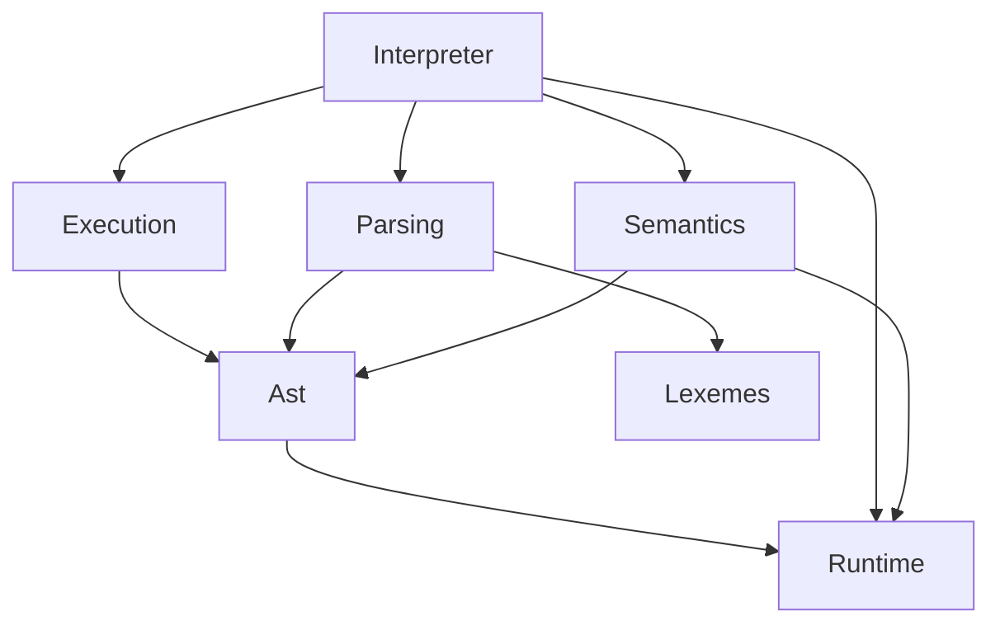
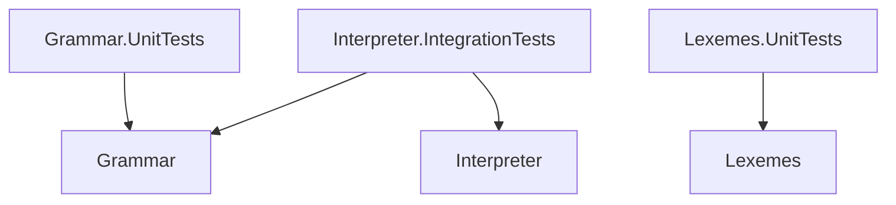

# Интерпретатор языка Tiger

Tiger — учебный язык программирования, разработанный Andrew Appel для книг и курсов в Princeton University.

Цель этого проекта — написать полный интерпретатор Tiger на C# для демонстрации в качестве примера.

## Статус

Статус поддержки возможностей языка:

1. [x] Валидация программы на соответствие грамматике на ANTLR4
2. [x] Лексический анализ
3. [x] Разбор и вычисление выражений
4. [x] Переменные, let...int... и присваивания
5. [x] Ветвления
6. [x] Пользовательские функции и процедуры
7. [x] Циклы while и for
8. [x] Массивы и объявления типов
9. [x] Структуры и nil

Статус поддержи фаз компиляции:

1. [x] Лексический анализ
2. [x] Синтаксический анализ
3. [x] Семантический анализ
4. [ ] Генерация кода для виртуальной машины
5. [x] Выполнение программы

## Ветки

| Ветка               | Что добавляет                        |
|---------------------|--------------------------------------|
| 01_grammar_checker  | Валидатор синтаксиса на ANTLR4       |
| 02_lexical_analysis | Лексический анализ Tiger             |
| 03_expressions      | Разбор выражений                     |
| 04_variables        | Переменные и присваивания            |
| 05_if_else          | Ветвления                            |
| 06_functions        | Пользовательские функции и процедуры |
| 07_loops            | Циклы for и while, выражение break   |
| 08_arrays           | Массивы и объявления типов           |
| 09_records          | Структуры и nil                      |
| 10_virtual_machine  | Виртуальная машина для исполнения    |

## Клонирование проекта

Клонирование без авторизации в SourceCraft:

```bash
# Клонируем репозиторий в каталог pstiger/
git clone https://git@git.sourcecraft.dev/sshambir-public/pstiger.git
```

Если у вас есть аккаунт SourceCraft и вы настроили SSH-ключи, то можно клонировать по SSH:

```bash
# Клонируем репозиторий в каталог pstiger/
git clone ssh://ssh.sourcecraft.dev/sshambir-public/pstiger.git
```

## Сборка

Сборка консольной утилитой dotnet из .NET SDK:

```bash
# Сборка.
dotnet build

# Запуск тестов.
dotnet test

# Запуск бенчмарка
dotnet run -c Release --project tests/Interpreter.Benchmarks
```

## Результаты бенчмарка

Бенчмарки используют библиотеку [BenchmarkDotNet](https://benchmarkdotnet.org).

Ветка `10_benchmarks`, коммит `ccbf9210fcd494b7f861e299663ae04f66ebf305`, интерпретатор вычисляет программу путём обхода AST:

```js
BenchmarkDotNet v0.15.8, Linux Ubuntu 24.04.2 LTS (Noble Numbat)
AMD Ryzen 7 4800H with Radeon Graphics 1.40GHz, 1 CPU, 16 logical and 8 physical cores
.NET SDK 8.0.409
  [Host]     : .NET 8.0.16 (8.0.16, 8.0.1625.21506), X64 RyuJIT x86-64-v3
  Job-UNGBHD : .NET 8.0.16 (8.0.16, 8.0.1625.21506), X64 RyuJIT x86-64-v3

InvocationCount=1  IterationCount=10  LaunchCount=1  
UnrollFactor=1  WarmupCount=2  

| Method         | N     | Mean      | Error     | StdDev    |
|--------------- |------ |----------:|----------:|----------:|
| ListPrimesUpTo | 1000  |  4.901 ms | 0.1087 ms | 0.0569 ms |
| ListPrimesUpTo | 10000 | 43.953 ms | 9.9267 ms | 5.1919 ms |
```

Аналогичный алгоритм, реализованный на C#, на той же машине работает примерно в 500 раз быстрее при N=10000:

```
| Method         | N     | Mean      | Error     | StdDev    |
|--------------- |------ |----------:|----------:|----------:|
| ListPrimesUpTo | 1000  |  5.911 us | 0.1403 us | 0.0835 us |
| ListPrimesUpTo | 10000 | 95.027 us | 5.8080 us | 3.8416 us |
```

## Архитектура

Проект написан на C# 12 и .NET 8.

Взаимосвязь модулей:



## Покрытие тестами

В проекте есть:

1. Приёмочные интеграционные тесты: `Interpreter.IntegrationTests`
2. Тесты модуля Grammar, содержащего валидатор синтаксиса на ANTLR4: `Grammar.UnitTests`
3. Тесты модуля Lexer, содержащего лексический анализатор: `Lexemes.UnitTests`



## Лицензия

- Исходный код интерпретатора доступен под лицензией MIT.
- Тесты в каталоге `tests/Grammar.UnitTests/valid/` используются на правах GPL 3.0, поскольку скопированы из репозитория https://gitlab.com/gwasser/lambdatiger
