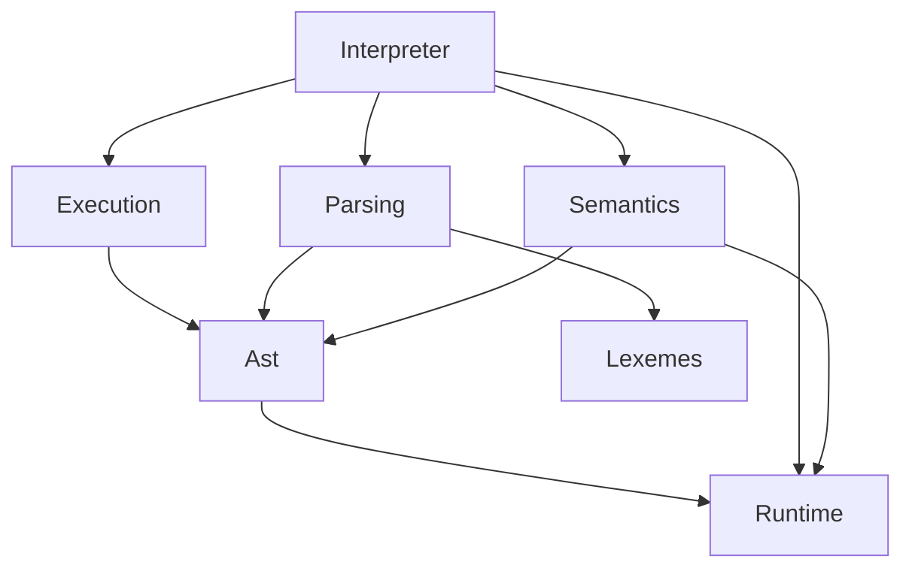
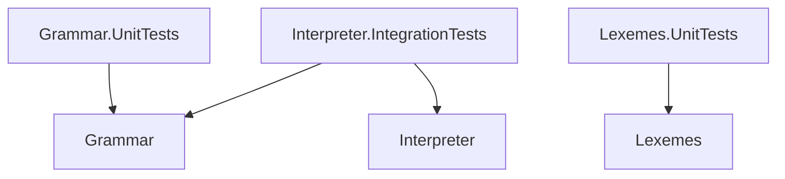

# Интерпретатор языка Tiger

Tiger — учебный язык программирования, разработанный Andrew Appel для книг и курсов в Princeton University.

Цель этого проекта — написать полный интерпретатор Tiger на C# для демонстрации в качестве примера.

## Статус

Статус поддержки возможностей языка:

1. [x] Валидация программы на соответствие грамматике на ANTLR4
2. [x] Лексический анализ
3. [x] Разбор и вычисление выражений
4. [x] Переменные, let...int... и присваивания
5. [x] Ветвления
6. [x] Пользовательские функции и процедуры
7. [x] Циклы while и for
8. [ ] Массивы и объявления типов
9. [ ] Структуры и nil

Статус поддержи фаз компиляции:

1. [x] Лексический анализ
2. [x] Синтаксический анализ
3. [x] Семантический анализ
4. [ ] Генерация кода для виртуальной машины
5. [x] Выполнение программы

## Ветки

| Ветка               | Что добавляет                        |
|---------------------|--------------------------------------|
| 01_grammar_checker  | Валидатор синтаксиса на ANTLR4       |
| 02_lexical_analysis | Лексический анализ Tiger             |
| 03_expressions      | Разбор выражений                     |
| 04_variables        | Переменные и присваивания            |
| 05_if_else          | Ветвления                            |
| 06_functions        | Пользовательские функции и процедуры |
| 07_loops            | Циклы for и while, выражение break   |

## Клонирование проекта

Клонирование без авторизации в SourceCraft:

```bash
# Клонируем репозиторий в каталог pstiger/
git clone https://git@git.sourcecraft.dev/sshambir-public/pstiger.git
```

Если у вас есть аккаунт SourceCraft и вы настроили SSH-ключи, то можно клонировать по SSH:

```bash
# Клонируем репозиторий в каталог pstiger/
git clone ssh://ssh.sourcecraft.dev/sshambir-public/pstiger.git
```

## Сборка

Сборка консольной утилитой dotnet из .NET SDK:

```bash
# Сборка.
dotnet build

# Запуск тестов.
dotnet test
```

## Архитектура

Проект написан на C# 12 и .NET 8.

Взаимосвязь модулей:



## Покрытие тестами

В проекте есть:
1. Приёмочные интеграционные тесты: `Interpreter.IntegrationTests`
2. Тесты модуля Grammar, содержащего валидатор синтаксиса на ANTLR4: `Grammar.UnitTests`
3. Тесты модуля Lexer, содержащего лексический анализатор: `Lexemes.UnitTests`



## Лицензия

- Исходный код интерпретатора доступен под лицензией MIT.
- Тесты в каталоге `tests/Grammar.UnitTests/valid/` используются на правах GPL 3.0, поскольку скопированы из репозитория https://gitlab.com/gwasser/lambdatiger
