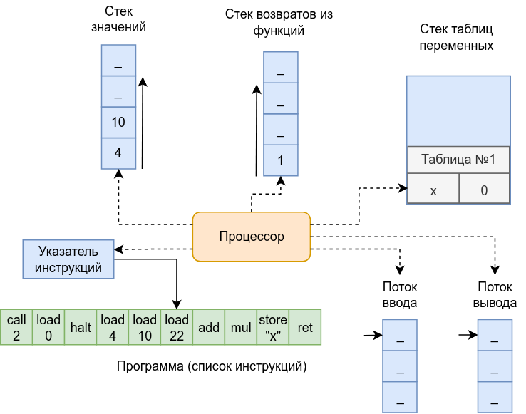

# Виртуальная машина Tiger

Виртуальная машина Tiger выполняет инструкции по определённым правилам, тем самым обеспечивая возможность вычисления любой программы на Tiger.

Эта статья описывает принцип работы (модель работы) виртуальной машины Tiger.

## Иллюстрация

Иллюстрация состояния виртуальной машины языка Tiger в момент выполнения программы:

## Модель виртуальной машины

Структура машина Tiger состоит из следующих элементов:

1. Список инструкций, составляющих программу;
2. Указатель на следующую инструкцию;
3. Стек значений, используемый для вычисления выражений;
4. Стек возвратов из функций, используемый для восстановления указателя на следующую инструкцию после вызова функции;
5. Стек таблиц переменных, созданных по числу областей видимости;
6. Входной поток (stdin);
7. Выходной поток (stdout) с буферизацией вывода;
8. Процессор, обрабатывающий инструкции.

## Инструкции

Каждая инструкция программы содержит:

1. Код инструкции из набора инструкций
2. Значение операнда (необязательное)

## Набор инструкций

Каждая инструкция может иметь один операнд, который хранится вместе с инструкцией.

Условные обозначения в списке инструкций:

- Операнд указывается в квадратных скобках, например: `[Value]`;
- Вершина стека вычислений обозначается `EVAL[^1]`, следующее за ней значения — `EVAL[^2]`, `EVAL[^3]` и так далее
- Каждая инструкция имеет свой номер (индекс), нумерация инструкций начинается с 0

Список инструкций:

1. `Push [Value]` добавляет значение на стек вычислений
    - Операнд хранит добавляемое значение
2. `Pop` удаляет значение со стека вычислений
3. `Duplicate` дублирует значение на вершине стека вычислений
    - Добавляет на стек вычислений значение, равное предыдущей вершине стека
4. `LoadVar [Name]` читает значение переменной
    - Операнд хранит имя переменной
    - Помещает результат в стек вычислений
5. `DefineVar [Name]` записывает в новую переменную значение `EVAL[^1]`
6. `StoreVar [Name]` записывает в ранее созданную переменную значение `EVAL[^1]`
    - Операнд хранит имя переменной
    - Убирает значение со стека вычислений
    - Бросает исключение, если нет ни одной активной таблицы переменных
7. `CreateArray` создаёт массив размера `EVAL[^2]`, инициализируя каждый элемент значением `EVAL[^1]`
    - Убирает два значения со стека вычислений, помещает результат в стек вычислений
8. `StoreArray` сохраняет в массив `EVAL[^3]` по индексу `EVAL[^2]` значение `EVAL[^1]`
    - Убирает три значения со стека вычислений
9.  `LoadArray` читает элемент массива `EVAL[^2]` по индексу `EVAL[^1]`
    - Снимает два значения со стека вычислений, результат помещает в стек вычислений
10. `InitField [Name]` сохраняет в поле `[Name]` структуры `EVAL[^2]` значение `EVAL[^1]`
    - Убирает одно значение со стека вычислений (ссылка на структуру остаётся в стеке вычислений)
11. `StoreField [Name]` сохраняет в поле `[Name]` структуры `EVAL[^2]` значение `EVAL[^1]`
    - Убирает два значения со стека вычислений
12. `LoadField [Name]` читает поле `[Name]` структуры `EVAL[^1]`
    - Операнд хранит имя поля структуры
    - Снимает значение со стека вычислений, результат помещает в стек вычислений
13. `Add` выполняет бинарную операцию целочисленного сложения
    - Вычисляет `EVAL[^2] + EVAL[^1]`
    - Снимает два значения со стека вычислений, результат помещает в стек вычислений
14. `Subtract` выполняет бинарную операцию целочисленного вычитания
    - Вычисляет `EVAL[^2] - EVAL[^1]`
    - Снимает два значения со стека вычислений, результат помещает в стек вычислений
15. `Multiply` выполняет бинарную операцию целочисленного умножения
    - Вычисляет `EVAL[^2] * EVAL[^1]`
    - Снимает два значения со стека вычислений, результат помещает в стек вычислений
16. `Divide` выполняет бинарную операцию целочисленного деления
    - Вычисляет `EVAL[^2] / EVAL[^1]`
    - Снимает два значения со стека вычислений, результат помещает в стек вычислений
17. `And` выполняет бинарную операцию "логическое и"
    - Вычисляет `EVAL[^2] & EVAL[^1]`
    - Снимает два значения со стека вычислений, результат помещает в стек вычислений
18. `Or` выполняет бинарную операцию "логическое или"
    - Вычисляет `EVAL[^2] | EVAL[^1]`
    - Снимает два значения со стека вычислений, результат помещает в стек вычислений
19. `Equal` выполняет бинарную операцию "равно"
    - Вычисляет `EVAL[^2] = EVAL[^1]`
    - Снимает два значения со стека вычислений, результат помещает в стек вычислений
20. `NotEqual` выполняет бинарную операцию "не равно"
    - Вычисляет `EVAL[^2] <> EVAL[^1]`
    - Снимает два значения со стека вычислений, результат помещает в стек вычислений
21. `Less` выполняет бинарную операцию "меньше"
    - Вычисляет `EVAL[^2] < EVAL[^1]`
    - Снимает два значения со стека вычислений, результат помещает в стек вычислений
22. `LessOrEqual` выполняет бинарную операцию "меньше или равно"
    - Вычисляет `EVAL[^2] <= EVAL[^1]`
    - Снимает два значения со стека вычислений, результат помещает в стек вычислений
23. `Negate` выполняет унарную операцию "минус"
    - Снимает значение со стека вычислений, результат помещает в стек вычислений
24. `Not` выполняет унарную операцию логического отрицания
    - Снимает значение со стека вычислений, результат помещает в стек вычислений
25. `Jump [Target]` выполняет безусловный переход
    - Операнд хранит номер инструкции, на которую выполняется переход
26. `JumpIfTrue [Target]` выполняет условный переход, если условие истинно
    - Операнд хранит номер инструкции, на которую выполняется переход
    - Переход выполняется, если `EVAL[^1]` — число, отличное от 0
    - Снимает одно значение из стека
27. `JumpIfFalse [Target]` выполняет условный переход, если условие ложно
    - Операнд хранит номер инструкции, на которую выполняется переход
    - Переход выполняется, если `EVAL[^1]` — число 0
    - Снимает одно значение из стека
28. `CallBuiltin [Name]` вызывает встроенную функцию
    - Операнд хранит имя встроенной функции
    - Указатель инструкций не меняется
    - Аргументы передаются через стек, где `EVAL[^1]` — последний из N аргументов, а `EVAL[^N]` — первый аргумент
    - Возвращаемое значение (если оно есть) передаётся через стек в `EVAL[^1]`
29. `Call [Index]` вызывает функцию, меняя указатель инструкций
    - Операнд хранит номер инструкции, с которой начинается функция
    - Прежнее значение указателя инструкций и ссылка на таблицу переменных сохраняются в стек возвратов
    - Аргументы передаются через стек, где `EVAL[^1]` — последний из N аргументов, а `EVAL[^N]` — первый аргумент
    - Возвращаемое значение (если оно есть) передаётся через стек в `EVAL[^1]`
30. `Return` завершает текущую функцию
    - Восстанавливает значение указателя инструкций и ссылку на таблицу переменных, снимая их из стека возвратов
    - Если функция имеет возвращаемое значение, то результат функции остаётся в стеке вычислений
31. `StoreResult` устанавливает результат работы программы
    - Снимает значение со стека вычислений, используя его как результат работы программы (произвольное значение)
32. `Halt` останавливает работу программы
    - Снимает значение со стека вычислений, используя его как целочисленный код возврата
33. `PushVars [Index]` добавляет новую таблицу переменных, дочернюю по отношению к указанной таблице переменных
    - Операнд хранит глубину таблицы переменных, которая станет родительской по отношению к новой таблице
    - Если операнд равен 0, то новая таблица переменных создаётся без ссылки на родительскую и имеет глубину 1
    - Новая таблица переменных имеет глубину на 1 больше, чем родительская
    - Инструкция соответствует входу во вложенную область видимости
34. `PopVars` убирает текущую таблицу переменных, заменяя её на родительскую таблицу переменных
    - Инструкция соответствует выходу из вложенной области видимости
